# Excalidraw Copilot 🎨

A VS Code extension that generates beautiful, editable diagrams from natural language using your GitHub Copilot subscription. No API keys needed — just describe what you want.

## ✨ Features at a Glance

- 🗣️ **Natural language → Diagram** — describe it, see it
- 📂 **Code-aware** — right-click any folder or file to diagram its real architecture
- 🔄 **Conversational refinement** — chat to refine: *"add a caching layer"*, *"fix step 3"*
- 🧜 **Dual pipeline** — Mermaid native preview for architecture, Semantic DSL for processes
- 🔍 **Mermaid zoom, pan & export** — Ctrl+Scroll to zoom, export as SVG or PNG
- 🤖 **Model picker** — choose Claude Sonnet *(recommended for architecture)*, GPT-4o, Claude Opus *(best for detailed process flows)*, or any Copilot model
- 🧠 **Smart project detection** — type "diagram this project" and it auto-analyzes your workspace
- ✏️ **Fully editable** — every diagram lands on an Excalidraw canvas you can hand-edit

> **💡 Model tip:** For architecture/process diagrams, use **Sonnet** or **GPT-4o** — they produce cleaner, more readable layouts. **Opus** shines on detailed process flows and step-by-step tutorials where extra detail is a plus.

## 📸 See It in Action

### 1. Open the Command Palette and launch "Generate Diagram"
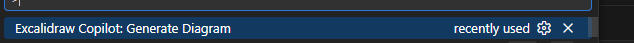

### 2. Type your prompt — any question or design request
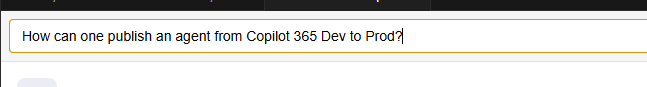

### 3. Pick your LLM model
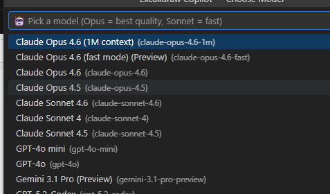

### 4. Get a beautiful process diagram (DSL pipeline)
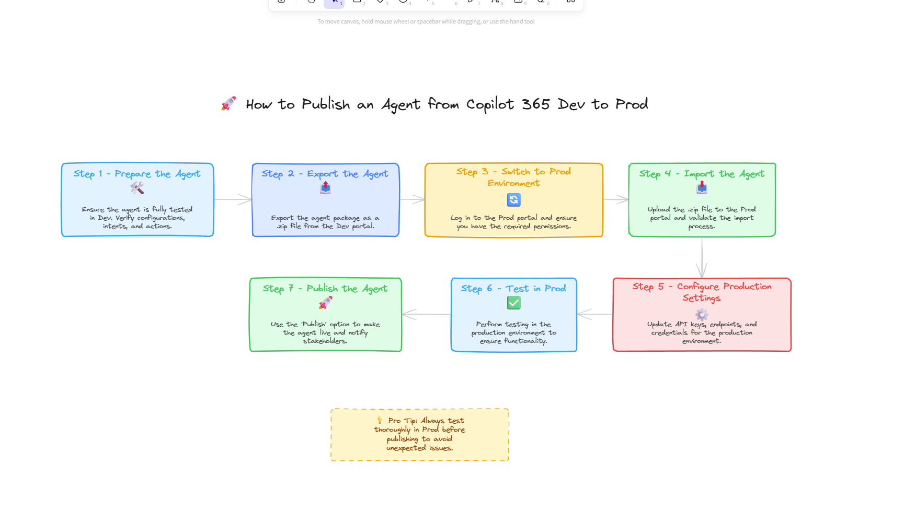

### 5. Refine with conversational feedback
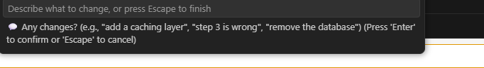

### 6. Try an architecture prompt — "Design Twitter"
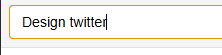

### 7. DSL pipeline — rich vertical architecture with emojis, colors, and pro tips
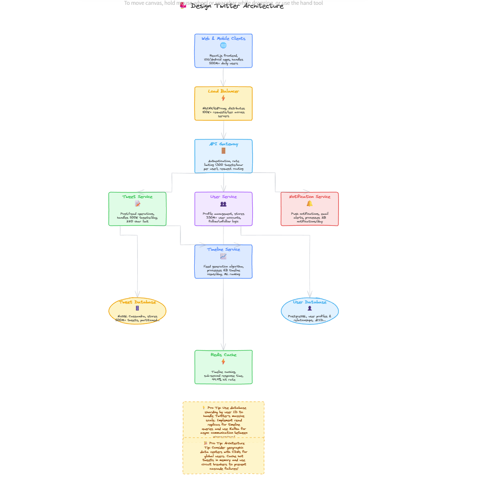

### 8. Mermaid pipeline — clean layered architecture with subgraphs
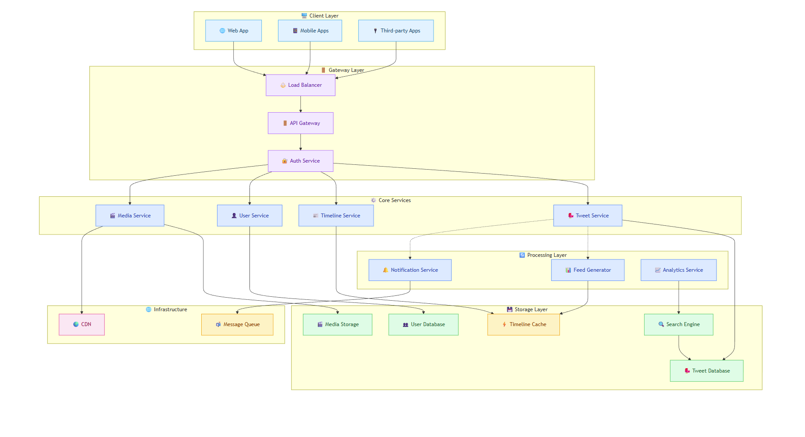

### 9. Right-click any file → "Diagram This File"
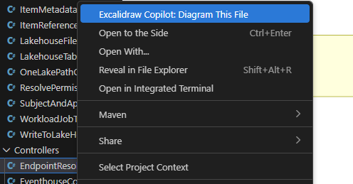

### 10. Right-click any folder → "Diagram This Folder" or "Diagram This Project"
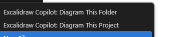

### 11. Full project architecture from real code analysis
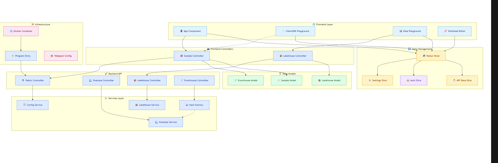

---

## 🚀 Quick Start

### 1. Clone & Install
```bash
git clone https://github.com/nadomani/excalidraw-copilot.git
cd excalidraw-copilot
npm install
cd webview-ui && npm install && cd ..
```

### 2. Build & Launch
Press **F5** in VS Code. This opens an Extension Development Host window with the extension loaded.

> If you see "errors exist after running preLaunchTask" — click **Debug Anyway** (it's a false alarm from DevSkim).

### 3. Generate Your First Diagram
In the **Extension Development Host** window:
1. `Ctrl+Shift+P` → **"Excalidraw Copilot: Generate Diagram"**
2. Pick a model (Opus = best quality, Sonnet = fast)
3. Choose a pipeline (Mermaid or Semantic DSL)
4. Type your prompt — watch the diagram render!
5. A feedback popup appears — describe changes or press Escape to finish
6. If you close the popup, a **"Continue Refining"** button lets you re-enter anytime

## 📋 Commands

| Command | How to Trigger | What It Does |
|---------|---------------|--------------|
| **Generate Diagram** | `Ctrl+Shift+P` → "Generate Diagram" | Free-text prompt → diagram |
| **Diagram This Folder** | Right-click folder in Explorer | Scans that folder's code, generates architecture |
| **Diagram This Project** | Right-click folder / `Ctrl+Shift+P` | Scans entire workspace, full project architecture |
| **Diagram This File** | Right-click file in Explorer / editor | Diagrams a file's internal structure |
| **Open Canvas** | `Ctrl+Shift+P` → "Open Canvas" | Opens a blank Excalidraw canvas |

## 🎯 Complete Usage Guide

### Free-Text Prompts
Type anything — the extension figures out the best approach:
```
Draw the architecture of Twitter
How to make cheese step by step
Create a flowchart for user registration with email verification
Design a microservices system with API gateway and message queue
```

### Smart Project Detection
Type prompts like **"diagram this project"** or **"show the architecture of this app"** in the prompt bar — the extension automatically scans your open workspace (files, dependencies, imports) and passes the real analysis to the LLM. No need to right-click.

### Diagram Your Code (Folder)
1. Right-click any **folder** in Explorer → **"Excalidraw Copilot: Diagram This Folder"**
2. The extension deep-scans that folder's code:
   - **File structure** and directory layout
   - **Component roles** — entry points, controllers, services, models, components, state/stores, utilities
   - **Import/dependency graph** — who imports whom
   - **External services** — databases (PostgreSQL, MongoDB, Redis), queues (Kafka, RabbitMQ), cloud services
   - **HTTP endpoints** — REST routes detected from code
   - **Frameworks** — React, Express, NestJS, .NET, Flask, and more
   - **Infrastructure** — Dockerfile, docker-compose analysis
3. Supports: `.ts`, `.tsx`, `.js`, `.jsx`, `.py`, `.cs`, `.java`, `.go`
4. The analysis is sent to the LLM — you get a diagram of your **actual** codebase, not a generic template

### Diagram Entire Project
1. Right-click any **folder** → **"Excalidraw Copilot: Diagram This Project"** (or use Command Palette)
2. Always scans the **entire workspace root** — gives you the full project architecture with all layers, components, and connections
3. Great for getting a high-level overview of a new codebase

### Diagram a Single File
1. Right-click a **file** → **"Excalidraw Copilot: Diagram This File"**
2. Shows classes, interfaces, functions, inheritance, method calls, and external dependencies

### Conversational Refinement
After every diagram, a feedback popup appears — refine by chatting:
```
"Add a caching layer between API and database"
"Step 3 is wrong — it should be pasteurize not boil"
"Remove the queue and connect directly"
"Add a step after step 2 for validation"
"Group all the databases together"
```
- Up to **10 refinement rounds** per session
- Press **Escape** to finish — a **"Continue Refining"** notification lets you re-enter the loop anytime
- Step numbers are **automatically renumbered** when you add or remove steps

### Model Selection
Every generation starts with a model picker:
- **Claude Sonnet** — ⭐ Recommended for architecture diagrams. Clean, well-structured output
- **GPT-4o** — ⭐ Also great for architecture. Fast and produces readable layouts
- **Claude Opus** — Best for detailed process diagrams and step-by-step flows. Can be *too* detailed for architecture (many nodes/connections), so prefer Sonnet or GPT-4o for system design
- Any other model available through your Copilot subscription

> **💡 Tip:** For architecture diagrams ("Design Twitter", "Diagram this project"), use **Sonnet** or **GPT-4o** — they produce cleaner, more readable layouts. Save **Opus** for detailed process flows and tutorials where extra detail is a plus.

### Pipeline Selection (Mermaid vs DSL)
After choosing a model, you pick a **rendering pipeline**. The extension recommends one based on your prompt:

| | 🎨 Semantic DSL | 🧜 Mermaid |
|--|-----------------|-----------|
| **Best for** | Process diagrams, recipes, tutorials | Architecture diagrams, system design |
| **Output** | Editable Excalidraw shapes | Native Mermaid preview → convert to Excalidraw |
| **Detail** | 15-30 nodes with emojis, colors, descriptions, pro tips | 15-25 nodes with subgraphs, clean layers |
| **Speed** | ~30-40 sec | ~15-20 sec |
| **Layout** | Custom grid engine with snake wrapping | Mermaid's dagre layout engine |
| **Colors** | Rich semantic palette (7 colors × 3 shades) | Per-node style directives (6 color categories) |

### Mermaid Preview Mode
When using the Mermaid pipeline, diagrams render as **native Mermaid** first (better layout and arrow routing than direct conversion). The preview includes:

- **Zoom** — `Ctrl+Scroll` to zoom in/out, or use the `+`/`−` buttons
- **Pan** — `Alt+Drag` or middle-click drag to pan around
- **Reset** — Click the `%` label or `⊡` button to reset zoom and pan
- **Export SVG** — Download the diagram as a vector SVG file
- **Export PNG** — Download as a high-resolution PNG (2× for crisp output)
- **Convert to Excalidraw** — Click the green button to convert to editable Excalidraw elements

### DSL Internals (For the Curious)
The Semantic DSL pipeline generates a JSON graph:
```json
{
  "title": "Twitter Architecture",
  "direction": "TB",
  "nodes": [
    {"id": "gateway", "type": "service", "label": "API Gateway", "emoji": "🚪", "semanticColor": "primary"},
    {"id": "redis", "type": "cache", "label": "Redis Cache", "emoji": "⚡", "semanticColor": "warning"}
  ],
  "connections": [{"from": "gateway", "to": "redis", "style": "dashed"}]
}
```

**Node types:** `service` (blue), `database` (green), `cache` (orange), `queue` (purple), `external` (gray), `user` (cyan), `process` (yellow), `decision` (red diamond)

**Semantic colors:** `primary` (blue), `secondary` (purple), `success` (green), `warning` (amber), `danger` (red), `info` (cyan), `neutral` (gray)

## 🔧 Development

### Build
```bash
npm install
npm run compile        # Build extension (webpack)
npm run watch          # Auto-rebuild on changes
```

### Webview (React/Excalidraw)
```bash
cd webview-ui
npm install
npm run build          # Production build (vite)
npm run dev            # Dev mode with hot reload
```

### Project Structure
```
src/
  extension.ts              # Commands, folder/file analysis, pipeline routing, feedback loops
  llm/
    SemanticDiagramService.ts  # Two-pass LLM generation (think → generate), refinement, Mermaid prompts
  dsl/
    types.ts                # Semantic graph types (nodes, connections, groups)
    prompt.ts               # LLM system prompts with schema + examples
  layout/
    engine.ts               # Grid layout, snake wrapping, arrow routing
  render/
    shapes.ts               # Semantic graph → Excalidraw elements
    styles.ts               # Color palette (7 colors × 3 shades)
  webview/
    WebViewPanel.ts         # VS Code WebView panel management
  types/
    messages.ts             # Extension ↔ WebView message protocol
webview-ui/
  src/
    App.tsx                 # React app: Excalidraw canvas + Mermaid preview mode
    hooks/useMessageBridge.ts  # WebView ↔ Extension messaging hook
docs/                       # Plans and design documents
.ai/                        # AI context (architecture, conventions)
```

## 🐛 Troubleshooting

**"GitHub Copilot is not available"**
- Install the GitHub Copilot extension
- Sign in to GitHub in VS Code
- Make sure your Copilot subscription is active

**Canvas not loading**
- Check Output panel: `Ctrl+Shift+U` → "Excalidraw Copilot"
- Open WebView DevTools: `Ctrl+Shift+P` → "Developer: Open Webview Developer Tools"

**Diagram shows generic architecture (not my project)**
- Use right-click → "Diagram This Folder" for code-aware analysis
- Or type "diagram this project" in the prompt bar — it auto-detects and scans your workspace
- Check the Output channel for `Project prompt detection: true`

**Diagram looks wrong or incomplete**
- Use the feedback loop to refine: *"move X to the right"*, *"add Y"*
- Try a different model (Opus produces the most detailed results)
- Try the other pipeline (Mermaid vs DSL) for a different perspective
- Check the Output channel for the generated graph/Mermaid

**Mermaid preview not rendering**
- Open WebView DevTools to check for console errors
- Check the Output channel for the generated Mermaid syntax

**Build errors on F5**
- Run `npm run compile` manually to see actual errors
- The "preLaunchTask errors" dialog is usually a false alarm — click **Debug Anyway**

## ⚠️ Known Limitations

- **Mermaid → Excalidraw conversion quality** — The "Convert to Excalidraw" button uses the third-party [`@excalidraw/mermaid-to-excalidraw`](https://github.com/excalidraw/mermaid-to-excalidraw) library, which can produce degraded arrow routing, overlapping labels, and spacing issues compared to the native Mermaid preview. For best visual results, use the **Mermaid preview mode** (with zoom, pan, and SVG/PNG export) and only convert to Excalidraw when you need to hand-edit individual elements.
- **Complex DSL diagrams (20+ nodes)** — Arrow overlaps can occur on dense diagrams with many cross-layer connections. Use the feedback loop to simplify or regroup.
- **LLM variability** — Results vary by model. Claude Opus produces the most detailed and accurate diagrams. Smaller models may oversimplify or hallucinate components.

## 📄 License

MIT
